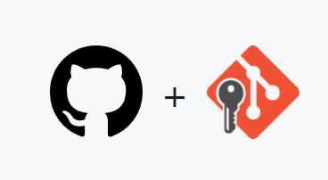
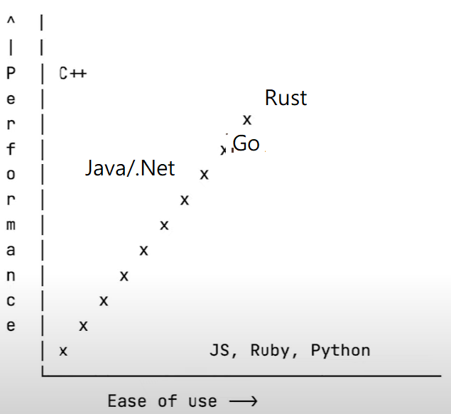

# 網頁設計及應用-入門

## 前言

自我介紹，做過電腦老師及開發程式。每當培訓課時被問，隔離是公務員、慱企、大公營事業等等，我說自己還是有理想的，真是來學野的!

綜述個人對網站編程技能總結，寫一些最簡單用法，同學們分享。不足之處，請多指教!

## Git/GitHub 源碼版本管理

網頁存於在github.io, 是github提供的功能!  

   


學習推薦     
👍[生產力Git課程](https://github.com/makzan/beginning-git-version-control)    
👍[Github QuickStart](https://docs.github.com/en/get-started/quickstart/hello-world)


簡單說明關係!   
GitHub is a code hosting platform for version control and collaboration. It lets you and others work together on projects from anywhere.
源碼版本管理及恊作遠端雲平台，讓你同其人也一齊恊助完成項目(不限地點)。

Git is a free and open source distributed version control system designed to handle everything from small to very large projects with speed and efficiency.(free and open source)源碼版本管理系統。

   

作業:

1. [安裝Git](https://git-scm.com/download/win)   

2. [註冊GitHub](https://github.com/signup?ref_cta=Sign+up&ref_loc=header+logged+out&ref_page=%2F&source=header-home)  
假設:  
註冊Email: tigeryear2022@gmail.com   
註冊用戶: tigeryear2022    

3. Github Pages    
參考[Github Pages QuickStart](https://docs.github.com/cn/pages/getting-started-with-github-pages/creating-a-github-pages-site)     
假設: tigeryear2022.github.io 
選擇:Theme  
自動生index.md(使用Markdown文檔指令。註:這裡用md格式, 而不是html格式)     
學習html標籤排版      
A.標題字  
B.段落     
C.插入圖片    
D.超連結   

4. 使用Git指令   

git clone、 git add、commit、 push。   

```cmd
(env) C:\code>git clone https://github.com/tigeryear2022/tigeryear2022.github.io
Cloning into 'tigeryear2022.github.io'...
remote: Enumerating objects: 223, done.
remote: Counting objects: 100% (206/206), done.
remote: Compressing objects: 100% (184/184), done.
remote: Total 223 (delta 97), done.
Resolving deltas: 100% (97/97), done.
(env) C:\code>cd tigeryear2022.github.io
(env) C:\code\tigeryear2022.github.io>
(env) c:\code\tigeryear2022.github.io>git --global user.email="tigeryear2022@gmail.com"
(env) c:\code\tigeryear2022.github.io>git --global user="tigeryear2022"
(env) c:\code\tigeryear2022.github.io>notepad index.md 
(env) C:\code\tigeryear2022.github.io>git add .
(env) C:\code\tigeryear2022.github.io>git commit -m "update readme.md"
[main 77f5e2a] update readme.md 1 file changed, 12 insertions(+), 2 deletions(-)
(env) C:\code\tigeryear2022.github.io>git push
Enumerating objects: 5, done.
Counting objects: 100% (5/5), done.
remote: Resolving deltas: 100% (2/2), completed with 2 local objects.
f8dbdd1..77f5e2a  main -> main

```

5. 我第一個HTML

文件結構
```text
static\a.js
static\a.css
static\a.png
first.html
index.md
```
[first.html...](first.html)  

&#x201C;http://www.example.com/report&#x201D;:

<pre style="color:white;">
&lt;html&gt;
  &lt;head&gt;
    &lt;script src=static/a.js&gt;&lt;/script&gt;
    &lt;script&gt;
       // do here;
    &lt;/script&gt;

    &lt;link rel="stylesheet" href="static/a.css"&gt;
    &lt;style&gt;
      /* do here */
      p.moreinfo { font-style: italic }
    &lt;/style&gt;
  &lt;/head&gt;
  &lt;body&gt;
    &lt;h1&gt;My first Page &lt;/h1&gt;
    &lt;img src=a.png&gt;  

    &lt;p class="moreinfo"&gt;For more information see the
    &lt;a href="http://www.example.com/report"&gt;final report&lt;/a&gt;.&lt;/p&gt;

  &lt;/body&gt;
&lt;/html&gt;
</pre>

<p>
			   The <code>class</code> attribute on the
			   paragraph's start tag (&#x201C;&lt;p&gt;&#x201D;) can be
			   used, among other thing, to add style. For
			   instance, to italicize the text of all
			   paragraphs with a class of &#x201C;moreinfo,&#x201D; one
			   could write, in CSS:
</p>

<pre style="color:white;">
p.moreinfo { font-style: italic }
</pre>

[git內容...](lecture/git.html) 


[文檔書寫 MarkDowm](https://www.markdownguide.org/basic-syntax/)  

The Markdown Guide is a free and open-source reference guide that explains how to use Markdown, the simple and easy-to-use markup language you can use to format virtually any document.

## 一. Web 前端

參考標準[w3](https://www.w3.org/standards/webdesign/)分類，HTML&CSS , JavaScript Web APIs 


### HTML&CSS

HTML is the markup language that we use to structure and give meaning to our web content, for example defining paragraphs, headings, and data tables, or embedding images and videos in the page.

CSS is a language of style rules that we use to apply styling to our HTML content, for example setting background colors and fonts, and laying out our content in multiple columns.

[html5內容...](lecture/html5.html)   
[ccs3內容...](lecture/css3.html)   

### JavaScript

JavaScript is a scripting language that enables you to create dynamically updating content, control multimedia, animate images, and pretty much everything else. (Okay, not everything, but it is amazing what you can achieve with a few lines of JavaScript code.)

基礎JS(variable, if, loop, function, JSON), 進階(DOM, AJAX, Async/Sync)。

[js內容...](lecture/js_ex.html)   

### 進階應用jQuery及UI

jQuery是一套跨瀏覽器的JavaScript函式庫，用於簡化HTML與JavaScript之間的操作。

[jquery內容...](lecture/jquery_ex.html)   
[jqueryUI內容...](lecture/jquery_ui_ex.html)   

### Bootstrap

自適應網頁設計(Responsive web design)，網頁自適應不同設備如, 電腦、手機、平板等設備Monitor尺寸。

[Bootstrap內容...](lecture/bootstrap_ex.html)   

## 二.  Python 易學易用
從下圖看出易學易用。最適合快速上手的人士!講求正確,不求速度。  
python效能是相對的,對我們普通人來,速快足够快!  
易用性，還有Node JS。   
 
推薦     
👍[生產力Python課程](https://github.com/makzan/Beginning-Python-Course)

[python download](https://www.python.org/downloads/windows/)
```cmd
Python 3.9.9 - Nov. 15, 2021
Note that Python 3.9.9 cannot be used on Windows 7 or earlier.
Download Windows installer (64-bit)
```

自帶模組管理程式: pip

## 三. 資料庫MySQL/SQLite,Redis


[sqlite-tools-win32-x86-3370100.zip](https://sqlite.org/download.html)

[Redis-x64-3.0.504.msi](https://github.com/microsoftarchive/redis/releases)

## 四. Web 后端

### Django/Flask網站應用框架

二者皆為Python網站應用框架。

   

我會主要介紹Flask。   

The “micro” in microframework means Flask aims to keep the core simple but extensible.  
Flask是一個使用Python編寫的Web應用微框架。基於Werkzeug WSGI工具箱和Jinja2模板引擎，使用簡單的核心，用擴充增加其他功能。 

### Flask_Bookshelf例子
[bookshelf](https://github.com/lammou2020/bookshelf)

安裝所需模組    
requirements.txt   
```text
Flask=1.1.2
Flask-SQLAlchemy=2.4.4
PyMySQL==0.9.2
six==1.15.0
Flask-Session=0.3.2
redis=3.5.3
PyMySQL=0.10.1
```

### virtual_env、安裝模組並運行
```cmd
git clone https://github.com/lammou2020/bookshelf
bookshelf>python -m venv env
bookshelf>env\scripts\activate
(env) bookshelf>pip install -r requirements.txt
(env) bookshelf>python bookshelf\model_cloudsql.py
(env) bookshelf>python main.py
```

### Session會話

Flask-Session

### ORM資料庫操作

Flask-SQLAlchemy

## 五. 常用Python Module套件
```text
Requests 
Untangle
BeautifulSoup4
Selenium	
Numpy 
Pandas
MatPlotLib
python-docx
openpyxl
Scipy
Sympy
```

## 六. Computer_Language_for_Future未來程式比較

易用性,Python , JS, Ruby。   
難學的有 C ,C++,.net,Java。  
Go/Rust更具未來性，有餘力可以努力加油!   

## 七. Summary_總結

回顧，學習程式設計這門課的時候，理論算法很多。導師還是提供了實戰機會，數學基礎，職業技能，軟件技術趋向，英語技能，前沿性，當時沒懂。
我想寫總結一下Web前端和Python后端的技能，還有SampleCode實作分享! 努力寫作中! 耐心等待....

## 八. About_關於

我的[日記diary](diary.html)

我的動態域名,[464r747p64.qicp.vip](http://464r747p64.qicp.vip) 用不了,先留用着。   

contact to: mbc11thsp@gmail.com
