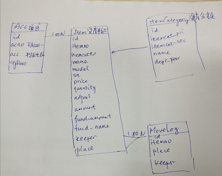

# 資產管理設計

## 1. 簡述設計思路

FA2021-ICT-001 一張單具按不同類別分

Acc:登為三個記錄:
FA2021-ICT-001-001 IPAD   
FA2021-ICT-001-002 Notebook   
FA2021-ICT-001-003 Laptop   
            
FA2021-ICT-001-001 IPAD 有六部
Acc--1toN--Item   

FA2021-ICT-001-001-0647-0001    
FA2021-ICT-001-001-0647-0002    
FA2021-ICT-001-001-0647-0003    
FA2021-ICT-001-001-0647-0004    
FA2021-ICT-001-001-0647-0005    
FA2021-ICT-001-001-0647-0006    

0647 定義及折舊年期定期    
Item.itemcatno<-------ItemCategory(0647+order_id)    

異動記錄    
Item--1toN--ItemMoveLog   

資料表:   
Acc 項目     
Item 資產項    
ItemCategory 資產編號折舊定義     
ItemMoveLog 異動記錄   

## 2. 基本結構
```python
# 按項目/發票定義 ACC[FA2021-xxx-001/-00[1-9]  ITEM [ACCNO]-[4271046][0001]
class Acc(db.Model):
    __tablename__ = 'Acc'
    id= db.Column(db.Integer,primary_key=True)
    acno = db.Column(db.String(16),unique=True,nullable=False)  #按項目/發票定義 ACC[FA2021-xxx-001/-00[1-9]
    acc= db.Column(db.String(160))  #名稱
    regSDate= db.Column(db.DateTime, nullable=False,default=datetime.utcnow) #登記日期
    describe=db.Column(db.Text)  # 描述

# 物品 ITEM  [FA2021-xxx-001/-00[1-9]-[4271046][0001]
class Item(db.Model):
    __tablename__ = 'Item'    
    id = db.Column(db.Integer,primary_key=True)
    itemno=db.Column(db.String(30),unique=True,nullable=True) # 物品編號
    itemcatno=db.Column(db.BigInteger,unique=True,nullable=True) # 物品分類編號
    name = db.Column(db.String(80))  # 產品
    model= db.Column(db.String(80))  # 型號
    sn = db.Column(db.String(80))    # SN/PN
    price = db.Column(db.Numeric(precision=10,scale=2))       # 單價
    quantity= db.Column(db.Integer)  # 數量
    adjust=  db.Column(db.Numeric(precision=10,scale=2))  # 攤折 
    amount=  db.Column(db.Numeric(precision=10,scale=2))  # 淨值
    fund_amount=db.Column(db.Integer)   # 資助金額
    fund_name=db.Column(db.String(80))  # 資助單位/個人
    keeper=db.Column(db.String(80))  # 移動 link to _table
    place =db.Column(db.String(80))  # 放置地方
    depr_rate   = db.Column(db.Integer)  # 0505 rate:5/5 NN總年期/淨灘折年期
    warr_period = db.Column(db.Numeric(precision=10,scale=2))  # 保養
    note1 =db.Column(db.Text)  # 不作地方記錄 描述
    note2 =db.Column(db.Text)  # 不作資助記錄
    # Acc_acno
    regSDate = db.Column(db.DateTime, nullable=False,default=datetime.utcnow) 
    acc_acno = db.Column(db.String(16), db.ForeignKey('Acc.acno'), nullable=False)
    acc      = db.relationship('Acc',  backref=db.backref('Item', lazy=True))

# 物品分類 ItemCategory [4271046][0001]
class ItemCategory(db.Model):
    __tablename__ = 'ItemCategory'    
    id = db.Column(db.Integer,primary_key=True)
    itemcat_pri=db.Column(db.BigInteger) # 物品分類編號
    itemcat_sec=db.Column(db.Integer) # 物品分類編號
    name = db.Column(db.String(80))  # 產品
    depr_year= db.Column(db.Integer)  # 攤折年期
    note1 =db.Column(db.Text)  # 不作地方記錄 描述
    note2 =db.Column(db.Text)  # 不作地方記錄 描述
    describe =db.Column(db.Text)  # 不作地方記錄 描述

# [ItemMoveLog]
class ItemMoveLog(db.Model):
    __tablename__ = 'ItemMoveLog'    
    id = db.Column(db.Integer,primary_key=True)
    itemno = db.Column(db.String(30), db.ForeignKey("Item.itemno"),nullable=True) # 物品編號
    item = db.relationship('Item', backref="places",lazy=True) 
    keeper=db.Column(db.String(80))  # 移動 link to _table
    place =db.Column(db.String(80))  # 放置地方
```

## CRUD及查詢

```python
from datetime import datetime
from flask import Flask
from sqlalchemy.sql.elements import between
from flask_sqlalchemy import SQLAlchemy
from sqlalchemy import desc
from intWeb import db
builtin_list = list

def init_app(app):
    # Disable track modifications, as it unnecessarily uses memory.
    app.config.setdefault('SQLALCHEMY_TRACK_MODIFICATIONS', False)
    db.init_app(app)

def from_sql(row):
    """Translates a SQLAlchemy model instance into a dictionary"""
    data = row.__dict__.copy()
    data['id'] = row.id
    data.pop('_sa_instance_state')
    return data

# 按項目/發票定義 ACC[FA2021-xxx-001/-00[1-9]  ITEM [ACCNO]-[4271046][0001]
class Acc(db.Model):
    __tablename__ = 'Acc'
    id= db.Column(db.Integer,primary_key=True)
    acno = db.Column(db.String(16),unique=True,nullable=False)  #按項目/發票定義 ACC[FA2021-xxx-001/-00[1-9]
    acc= db.Column(db.String(160))  #名稱
    regSDate= db.Column(db.DateTime, nullable=False,default=datetime.utcnow) #登記日期
    describe=db.Column(db.Text)  # 描述
    createdById = db.Column(db.String(255)) # 创建人編號
    ctime = db.Column(db.DateTime, nullable=False,default=datetime.utcnow)  #创建时间
    utime = db.Column(db.DateTime, nullable=False,default=datetime.utcnow)  #更新时间
    
    def __init__(self, acno=None, acc=None, regSDate=None, describe=None,createdById=None):
        self.acno=acno
        self.acc=acc
        self.regSDate=regSDate
        self.createdById=createdById
        self.describe=describe
    def __repr__(self):
        return "<acc(accno='%s', acc=%s)" % (self.accno, self.acc)    

# [ ACC crud]
def read(id):
    result = Acc.query.get(id)
    if not result:
        return None
    return from_sql(result)

def create(data):
    acc = Acc(**data)
    db.session.add(acc)
    db.session.commit()
    return from_sql(acc)

def update(data, id):
    acc = Acc.query.get(id)
    for k, v in data.items():
        setattr(acc, k, v)
    db.session.commit()
    return from_sql(acc)

def delete(id):
    Acc.query.filter_by(id=id).delete()
    db.session.commit()

# [START list_asc]
def list(limit=10, cursor=None):
    cursor = int(cursor) if cursor else 0
    query = (Acc.query
             #.filter_by(Open=1)
             .order_by(Acc.id)
             .limit(limit)
             .offset(cursor))
    lessons = builtin_list(map(from_sql, query.all()))
    next_page = cursor + limit if len(lessons) == limit else None
    return (lessons, next_page)

# 物品 ITEM  [FA2021-xxx-001/-00[1-9]-[4271046][0001]
class Item(db.Model):
    __tablename__ = 'Item'    
    id = db.Column(db.Integer,primary_key=True)
    itemno=db.Column(db.String(30),unique=True,nullable=True) # 物品編號
    itemcatno=db.Column(db.BigInteger,unique=True,nullable=True) # 物品分類編號
    name = db.Column(db.String(80))  # 產品
    model= db.Column(db.String(80))  # 型號
    sn = db.Column(db.String(80))    # SN/PN
    price = db.Column(db.Numeric(precision=10,scale=2))       # 單價
    quantity= db.Column(db.Integer)  # 數量
    adjust=  db.Column(db.Numeric(precision=10,scale=2))  # 攤折 
    amount=  db.Column(db.Numeric(precision=10,scale=2))  # 淨值
    fund_amount=db.Column(db.Integer)   # 資助金額
    fund_name=db.Column(db.String(80))  # 資助單位/個人
    keeper=db.Column(db.String(80))  # 移動 link to _table
    place =db.Column(db.String(80))  # 放置地方
    depr_rate   = db.Column(db.Integer)  # 0505 rate:5/5 NN總年期/淨灘折年期
    warr_period = db.Column(db.Numeric(precision=10,scale=2))  # 保養
    note1 =db.Column(db.Text)  # 不作地方記錄 描述
    note2 =db.Column(db.Text)  # 不作資助記錄
    # Acc_acno
    regSDate = db.Column(db.DateTime, nullable=False,default=datetime.utcnow) 
    acc_acno = db.Column(db.String(16), db.ForeignKey('Acc.acno'), nullable=False)
    acc      = db.relationship('Acc',  backref=db.backref('Item', lazy=True))
    # User info
    createdById = db.Column(db.String(255))    
    ctime    = db.Column(db.DateTime, nullable=False,default=datetime.utcnow)  #创建时间
    utime    = db.Column(db.DateTime, nullable=False,default=datetime.utcnow)  #更新时间
    describe = db.Column(db.Text)   

    def __init__(self, 
                 itemno=None,
                 itemcatno=None,
                 name=None,
                 model=None,
                 sn=None,
                 quantity=None,
                 price=None,
                 adjust=None,
                 amount=None,
                 fund_amount=None,
                 fund_name=None,
                 place=None,
                 keeper=None,
                 note1=None,
                 note2=None,
                 acc_acno=None,
                 regSDate=None,
                 createdById=None,
                 describe=None
                 ):
        self.itemno =itemno
        self.itemcatno =itemcatno
        self.name =name
        self.model =model
        self.sn =sn
        self.quantity =quantity
        self.price =price
        self.adjust = adjust
        self.amount = amount
        self.fund_amount = fund_amount
        self.fund_name = fund_name
        self.place=place
        self.keeper=keeper
        self.note1=note1
        self.note2=note2
        self.acc_acno=acc_acno
        self.regSDate=regSDate
        self.createdById=createdById
        self.describe=describe

    def __repr__(self):
        return "<item(name='%s')" % (self.name)    

#[ ITEM CRUD]
def readItem(id):
    result = Item.query.get(id)
    if not result:
        return None
    return from_sql(result)

def createItem(data):
    acc = Item(**data)
    db.session.add(acc)
    db.session.commit()
    return from_sql(acc)

def updateItem(data, id):
    acc = Item.query.get(id)
    for k, v in data.items():
        setattr(acc, k, v)
    db.session.commit()
    return from_sql(acc)

def deleteItem(id):
    Item.query.filter_by(id=id).delete()
    db.session.commit()

# [ 按地點查詢]
def locationitemlist_desc(roomid, buwei=1000000, limit=500,cursor=None):
    cursor = int(cursor) if cursor else 0
    query = (Item.query
             .filter(Item.note1.like(f"%{roomid}%"))
             .order_by(desc(Item.itemno))
             #.limit(limit)
             #.offset(cursor)
             )
    lessons = builtin_list(map(from_sql, query.all()))
    next_page = cursor + limit if len(lessons) == limit else None
    return (lessons, next_page)

# [ 按sn號查詢]
def snitemlist_desc(sn,buwei=1000000, limit=10,cursor=None):
    cursor = int(cursor) if cursor else 0
    query = (Item.query
             .filter(Item.sn.like(f"%{sn}%"))
             .order_by(desc(Item.itemno))
             .limit(limit)
             .offset(cursor))
    lessons = builtin_list(map(from_sql, query.all()))
    next_page = cursor + limit if len(lessons) == limit else None
    return (lessons, next_page)

# [ 按型號查詢]
def modelitemlist_desc(model,buwei=1000000, limit=10,cursor=None):
    cursor = int(cursor) if cursor else 0
    query = (Item.query
             .filter(Item.model.like(f"%{model}%"))
             .order_by(desc(Item.itemno))
             .limit(limit)
             .offset(cursor))
    lessons = builtin_list(map(from_sql, query.all()))
    next_page = cursor + limit if len(lessons) == limit else None
    return (lessons, next_page)

# [ 按產品號, 中的分類查詢]
def categoryitemlist_desc(cateid,buwei=1000000, limit=10,cursor=None):
    cursor = int(cursor) if cursor else 0
    sint=int(cateid)*buwei
    print(sint)
    query = (Item.query
             .filter(Item.itemcatno.between(sint,sint+buwei-1))
             .order_by(desc(Item.itemcatno))
             .limit(limit)
             .offset(cursor))
    lessons = builtin_list(map(from_sql, query.all()))
    next_page = cursor + limit if len(lessons) == limit else None
    return (lessons, next_page)

# [ 按票號查詢]
def Itemlist_by_acno(acc_acno):
    query = (Item.query
             .filter_by(acc_acno=acc_acno)
             .order_by(Item.id))
    lessons = builtin_list(map(from_sql, query.all()))
    return (lessons)

# [ START Item list]
def Itemlist(limit=10, cursor=None):
    cursor = int(cursor) if cursor else 0
    query = (Item.query
             #.filter_by(Open=1)
             .order_by(Item.id)
             .limit(limit)
             .offset(cursor))
    lessons = builtin_list(map(from_sql, query.all()))
    next_page = cursor + limit if len(lessons) == limit else None
    return (lessons, next_page)

# [ START Item list by desc]
def Itemlist_desc(limit=10, cursor=None):
    cursor = int(cursor) if cursor else 0
    query = (Item.query
             #.filter_by(Open=1)
             .order_by(desc(Item.id))
             .limit(limit)
             .offset(cursor))
    lessons = builtin_list(map(from_sql, query.all()))
    next_page = cursor + limit if len(lessons) == limit else None
    return (lessons, next_page)

# [START Item_list_by_CreateByUserID]
def Itemlist_by_user(user_id, limit=10, cursor=None):
    cursor = int(cursor) if cursor else 0
    query = (Item.query
             .filter_by(createdById=user_id)
             .order_by(Item.id)
             .limit(limit)
             .offset(cursor))
    lessons = builtin_list(map(from_sql, query.all()))
    next_page = cursor + limit if len(lessons) == limit else None
    return (lessons, next_page)
# [END Item_list_by_CreateByUserID]

# 物品分類 ItemCategory [4271046][0001]
class ItemCategory(db.Model):
    __tablename__ = 'ItemCategory'    
    id = db.Column(db.Integer,primary_key=True)
    itemcat_pri=db.Column(db.BigInteger) # 物品分類編號
    itemcat_sec=db.Column(db.Integer) # 物品分類編號
    name = db.Column(db.String(80))  # 產品
    depr_year= db.Column(db.Integer)  # 攤折年期
    note1 =db.Column(db.Text)  # 不作地方記錄 描述
    note2 =db.Column(db.Text)  # 不作地方記錄 描述
    describe =db.Column(db.Text)  # 不作地方記錄 描述
    def __init__(self, 
                 itemcat_pri=None,
                 itemcat_sec=None,
                 name=None,
                 depr_year=None,
                 note1=None,
                 note2=None,
                 describe=None
                 ):
        self.itemcat_pri =itemcat_pri
        self.itemcat_sec =itemcat_sec
        self.name =name
        self.depr_year =depr_year
        self.note1=note1
        self.note2=note2
        self.describe=describe

    def __repr__(self):
        return "<itemCate(name='%s')" % (self.name)    

#[ ITEMCat CRUD]
def readItemCat(id):
    result = ItemCategory.query.get(id)
    if not result:
        return None
    return from_sql(result)

def createItemCat(data):
    acc = ItemCategory(**data)
    db.session.add(acc)
    db.session.commit()
    return from_sql(acc)

def updateItemCat(data, id):
    acc = ItemCategory.query.get(id)
    for k, v in data.items():
        setattr(acc, k, v)
    db.session.commit()
    return from_sql(acc)

def deleteItemCat(id):
    ItemCategory.query.filter_by(id=id).delete()
    db.session.commit()

# [END ItemCategory]

# [ItemMoveLog]
class ItemMoveLog(db.Model):
    __tablename__ = 'ItemMoveLog'    
    id = db.Column(db.Integer,primary_key=True)
    itemno = db.Column(db.String(30), db.ForeignKey("Item.itemno"),nullable=True) # 物品編號
    item = db.relationship('Item', backref="places",lazy=True) 
    keeper=db.Column(db.String(80))  # 移動 link to _table
    place =db.Column(db.String(80))  # 放置地方
    createdById = db.Column(db.String(255))    
    ctime = db.Column(db.DateTime, nullable=False,default=datetime.utcnow)  #创建时间
    utime = db.Column(db.DateTime)  #更新时间
    
    def __init__(self, 
                 itemno=None,
                 place=None,
                 keeper=None,
                 createdById=None
                 ):
        self.itemno =itemno
        self.place=place
        self.keeper=keeper
        self.createdById=createdById

    def __repr__(self):
        return "<ItemMoveLog(name='%s')" % (self.name)    


#[ ItemMoveLog CRUD]
def readItemMoveLog(id):
    result = ItemMoveLog.query.get(id)
    if not result:
        return None
    return from_sql(result)

def createItemMoveLog(data):
    acc = ItemMoveLog(**data)
    db.session.add(acc)
    db.session.commit()
    return from_sql(acc)

def updateItemMoveLog(data, id):
    acc = ItemMoveLog.query.get(id)
    for k, v in data.items():
        setattr(acc, k, v)
    db.session.commit()
    return from_sql(acc)

def deleteItemMoveLog(id):
    ItemMoveLog.query.filter_by(id=id).delete()
    db.session.commit()

# [ 查詢]
def ItemMoveLoglist_by_itemno(itemno):
    query = (ItemMoveLog.query
             .filter_by(itemno=itemno)
             .order_by(desc(ItemMoveLog.id)))
    lessons = builtin_list(map(from_sql, query.all()))
    return (lessons)    

# [End ItemMoveLog]

```

[Return Home](/)